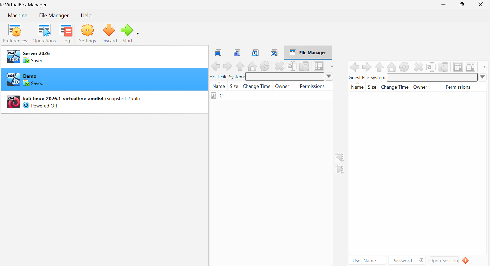

# 🛡️ Cybersecurity Homelab

A personal cybersecurity homelab built using **Oracle VirtualBox**, **Windows 10**, and **Kali Linux** to develop hands-on skills in penetration testing, threat detection, Windows security, digital forensics, and Security Operations Center (SOC) workflows.

This repository documents the entire process of building, configuring, and expanding the lab while showcasing practical cybersecurity projects.

---

# Lab Overview

Current Lab Environment

- 💻 Windows 10 Workstation
- 🐉 Kali Linux Attacker Machine
- 🖥️ Windows Server 2026 (Active Directory Lab - In Progress)

*Oracle VirtualBox Manager containing the virtual machines used throughout this homelab.*

---

# Objectives

- Build a professional cybersecurity homelab
- Practice offensive and defensive security
- Learn Windows Internals
- Simulate cyber attacks safely
- Investigate security alerts
- Build SOC Analyst skills
- Learn Detection Engineering
- Document projects professionally

---

# Technologies

- Oracle VirtualBox
- Windows 10
- Kali Linux
- Windows Server 2026
- Sysmon
- Wazuh
- TheHive
- Shuffle SOAR
- VirusTotal
- MITRE ATT&CK

---

# Documentation

| Guide | Description |
|--------|-------------|
| [Building the Homelab](docs/01-Building-the-Homelab.md) | Build the virtual environment |
| [Installing Sysmon](docs/02-Installing-Sysmon.md) | Install endpoint telemetry |
| Windows Hardening | Coming Soon |
| Wazuh Agent Setup | Coming Soon |
| Attack Simulations | Coming Soon |

---

# Current Progress

- ✅ Oracle VirtualBox Installed
- ✅ Windows 10 Installed
- ✅ Kali Linux Installed
- ✅ Virtual Networking Configured
- ✅ Sysmon Installed
- 🔄 Wazuh Integration
- 🔄 Active Directory
- 🔄 Detection Rules
- 🔄 SOC Automation

---

# Skills Demonstrated

- Virtualization
- Windows Administration
- Linux Administration
- Endpoint Security
- Networking
- Threat Detection
- Incident Response
- Documentation

---

This homelab continues to evolve as I learn new cybersecurity technologies and complete additional SOC projects.
