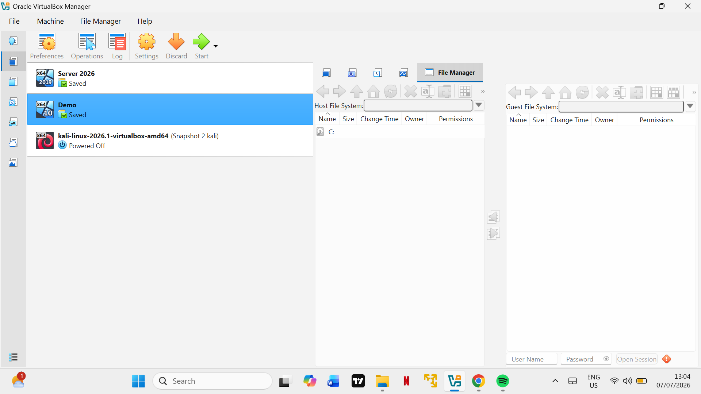
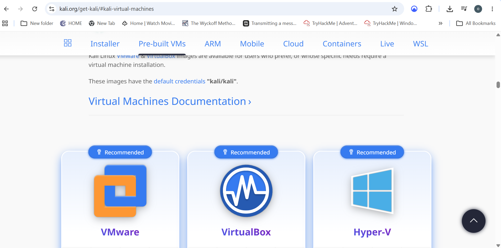
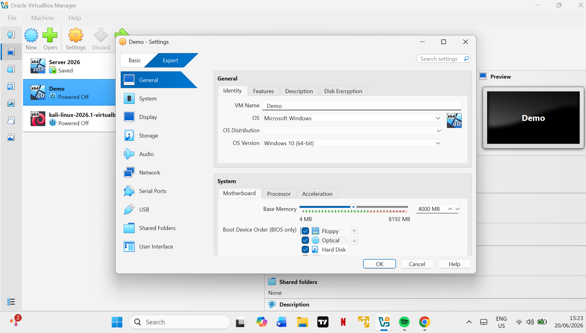
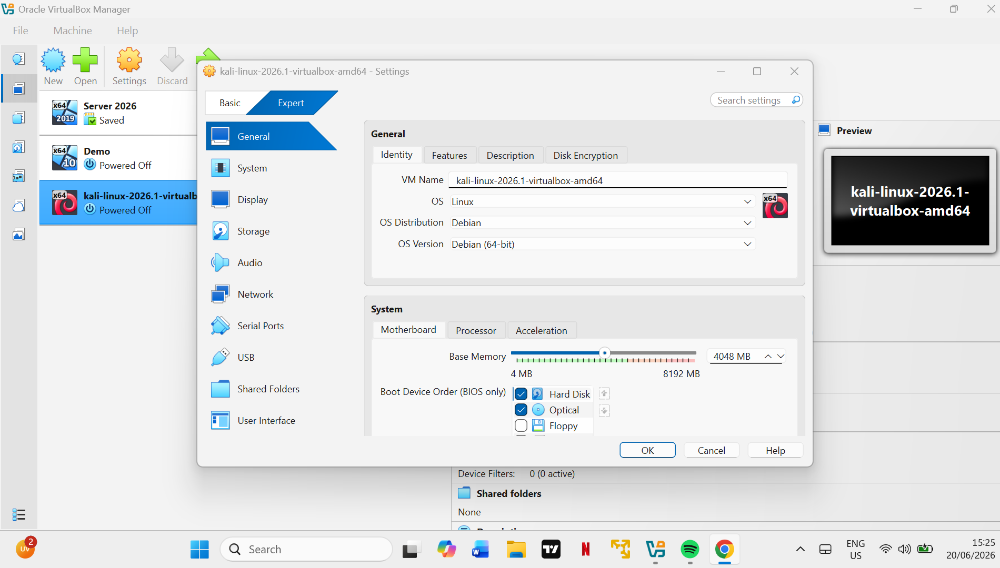

# Building My Cybersecurity Homelab

This guide documents how I built my cybersecurity homelab using **Oracle VirtualBox**, **Windows 10**, and **Kali Linux**.

---

## Lab Overview

The lab currently consists of:

| Machine | Purpose |
|--------|---------|
| Windows 10 | Victim / Workstation |
| Kali Linux | Attacker Machine |
| Windows Server 2026 | Future Active Directory |

<p align="center">

</p>

**Figure 1:** Oracle VirtualBox Manager showing the virtual machines used in the homelab.

---

## Step 1 — Install Oracle VirtualBox

Download Oracle VirtualBox:

https://www.virtualbox.org/wiki/Downloads

Install it and open VirtualBox.

<p align="center">

</p>

**Figure 2:** VirtualBox successfully installed and opened.

---

## Step 2 — Download the Operating Systems

Download the required operating systems.

| Software | Link |
|---------|------|
| Windows 10 ISO | https://www.microsoft.com/software-download/windows10 |
| Kali Linux VirtualBox Image | https://www.kali.org/get-kali/#kali-virtual-machines |

<p align="center">

</p>

**Figure 3:** Kali Linux VirtualBox image download page.

---

## Step 3 — Create the Windows 10 Virtual Machine

1. Open VirtualBox.
2. Click **New**.
3. Select the Windows 10 ISO.
4. Allocate memory.
5. Create a virtual hard disk.
6. Complete the Windows installation.

My Windows VM configuration:

- OS: Windows 10 64-bit
- RAM: 4000 MB

<p align="center">

</p>

**Figure 4:** Windows 10 virtual machine settings.

---

## Step 4 — Import Kali Linux

1. Download the Kali Linux VirtualBox image.
2. Extract the downloaded file.
3. Open VirtualBox.
4. Import or open the Kali virtual machine.
5. Confirm the VM settings.

My Kali VM configuration:

- OS: Debian 64-bit
- RAM: 4048 MB
- Boot device: Hard Disk

<p align="center">

</p>

**Figure 5:** Kali Linux virtual machine settings.

---

## Step 5 — Configure Networking

Open:

```text
Settings → Network
```

Configure both Windows 10 and Kali Linux to use the same internal network.

```text
Attached To: Internal Network
Name: intnet
```

This allows the two virtual machines to communicate while staying isolated.

---

## Step 6 — Assign Static IP Addresses

Example IP configuration:

| Machine | IP Address |
|--------|------------|
| Kali Linux | 192.168.56.10 |
| Windows 10 | 192.168.56.20 |

Both machines must be on the same subnet.

---

## Step 7 — Test Connectivity

After configuring the isolated network and assigning static IP addresses, verify that both virtual machines can communicate with each other.

From **Kali Linux**, ping the Windows 10 virtual machine:

```bash
ping 192.168.56.20
```

From **Windows 10**, ping the Kali Linux virtual machine:

```powershell
ping 192.168.56.10
```

If both commands return successful replies, the isolated VirtualBox network has been configured correctly, and the two virtual machines can communicate with each other.

> **Note:** If the ping requests fail, verify that:
> - Both virtual machines are connected to the same **Internal Network**.
> - Static IP addresses are configured correctly.
> - Windows Firewall is not blocking ICMP Echo Requests.
> - Both virtual machines are powered on and connected to the network.

---

## Step 8 — Next Steps

With the homelab successfully configured and network connectivity verified, the environment is now ready for endpoint monitoring and security analysis.

The next step in this project is installing **Sysmon (System Monitor)** on the Windows 10 virtual machine. Sysmon enhances Windows event logging by capturing detailed information about process creation, network connections, registry modifications, and other system activities.

These logs will later be integrated with security monitoring tools such as **Wazuh** to support alert generation, threat detection, and incident response exercises.

➡ Continue to **[02 - Installing Sysmon](02-Installing-Sysmon.md)**
