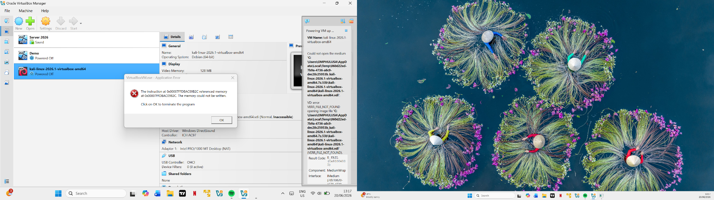

# Homelab Troubleshooting

This document records issues I encountered while building my cybersecurity homelab and how I resolved them.

---

## Issue 1 — VirtualBox VDI File Not Found

During the Kali Linux setup, I encountered a VirtualBox error where the virtual disk could not be found.

<p align="center">

</p>

**Figure 1:** VirtualBox VDI file error.

---

## Error

```text
VERR_FILE_NOT_FOUND
```

---

## Cause

The Kali Linux virtual disk file was missing or VirtualBox was pointing to the wrong file location.

This can happen when:

- The extracted Kali folder is moved
- The `.vdi` file is deleted
- The VM is imported incorrectly
- VirtualBox is still referencing an old file path

---

## Resolution

To fix the issue:

1. Removed the broken Kali VM entry from VirtualBox.
2. Re-extracted the Kali Linux VirtualBox image.
3. Re-imported the Kali virtual machine.
4. Confirmed the virtual disk path was correct.
5. Started the VM again.

---

## Lesson Learned

Virtual machine files should be kept in a dedicated folder and should not be moved after importing them into VirtualBox.
